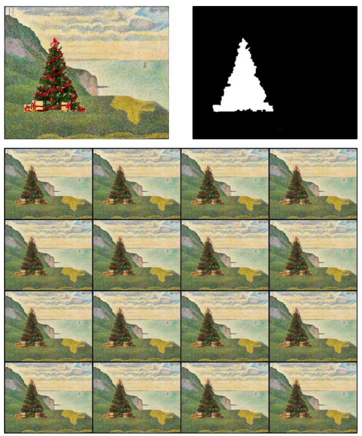

# Single-Image-Multi-Scale-Diffusion-Model

## Requirements
    python -m pip install -r requirements.txt
This code was tested with python 3.8 and torch 1.13.

[download pretrained blip](https://huggingface.co/Rookiehan/BLIP/blob/90e62d0d810aa28a0a88d8afef82f4735c6ae39c/model_base_capfilt_large.pth)


## Repository Structure 
```
├── SinDDM - training and inference code   
├── clip - clip model code
├── datasets - the images used in the paper
├── imgs - images used in this repository readme.md file
├── results - pre-trained models 
├── text2live_util - code for editing via text, based on text2live code 
└── main.py - main python file for initiate model training and for model inference
└── model_base_capfilt_large.pth
```


---
## Train
To train a model on your own image e.g. `<training_image.png>`, put the desired training image under `./datasets/<training_image>/`, and run
```
python main.py --scope <training_image> --mode train --dataset_folder ./datasets/<training_image>/ --image_name <training_image.png>
```

### for example:
```
python main.py --scope mountains_2 --mode train --dataset_folder ./datasets/try/mountains_2/ --image_name mountains_2.png
```

  
## Random sampling
To generate random samples, please first train a model on the desired image (as described above) or use a provided pretrained model, then run 
```
python main.py --scope <training_image> --mode sample --dataset_folder ./datasets/<training_image>/ --image_name <training_image.png> --load_milestone 12
```

    
## Harmonization

To harmonize a pasted object into an image, place a naively pasted reference image and the selected mask into `./datasets/<training_image>/i2i/` and run
```
python main.py --scope <training_image> --mode harmonization --harm_mask <mask_name> --input_image <naively_pasted_image> --dataset_folder ./datasets/<training_image>/ --image_name <training_image.png> --load_milestone 12
```

---
## Text guided Image Editing

To guide the generation to create new content using a given text prompt `<text_prompt>`, run 
```
python main.py --scope <training_image> --mode clip_content --clip_text <text_prompt> --strength <s> --fill_factor <f> --dataset_folder ./datasets/<training_image>/ --image_name <training_image.png> --load_milestone 12
```
 
### for example:
```
python main.py --scope mountains_2 --mode clip_content --clip_text 'Fire in the Mountains' --strength 0.5 --fill_factor 0.5 --dataset_folder ./datasets/try/mountains_2/ --image_name mountains_2.png --load_milestone 12
```
